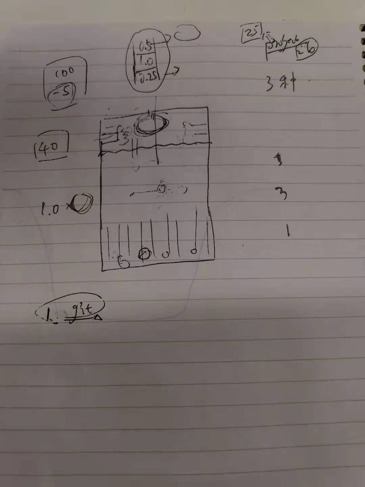

### 素材
- 手
- 机器人
- 3种垃圾（塑料袋，易拉罐，电路板）
- 对话框

### 元素
- ✅ 海浪 (addy)
- ✅ 水草 (leo)
- ✅垃圾 (addy)
- ✅手 (addy)
- 对话框
- ✅机器人 (addy)
- 鱼群 (qingyang)

- ✅垃圾悬停 (addy)
- ✅垃圾抛物线 (addy)
- ✅气泡 (leo)
- 垃圾拿回去 (addy)
- ✅蓝天，白云背景 (leo)
- 初始化垃圾 (addy)
- 水质  (leo)
- 海水圈渐变 （leo）

### 草图

